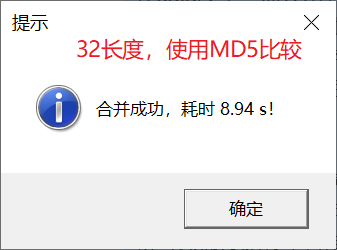

## MergeRTF

### 程序信息

- 名称：MergeRTF.sas
- 类型：Macro
- 依赖：无
- 功能：合并文件夹中的 RTF 文件。

### 程序执行流程

1. 根据参数 DIR 的值获取文件夹的物理路径
2. 使用 DOS 命令 `dir` 获取所有 RTF 文件，将文件路径存储在参数 DIR 指定的文件夹下的 `_tmp_rtf_list.txt` 中
3. 读取 `_tmp_rtf_list.txt`，识别、筛选符合要求的 RTF 文件
4. 对 RTF 文件进行排序
5. 对 RTF 文件建立文件引用（`filename` 语句）
6. 读取 RTF 文件
7. 检测 RTF 文件是否由 SAS 生成，且未被其他应用程序修改
8. 获取可以合并的 RTF 文件的引用列表
9. 处理 RTF 文件
10. 合并 RTF 文件
11. 输出合并后的 RTF 文件

### 参数

#### DIR

类型 : 必选参数

取值 : 指定 RTF 文件夹路径或引用。指定的文件夹路径或者引用的文件夹路径必须是一个合法的 Windows 路径。

- 指定物理路径时，可以传入带引号的路径或不带引号的路径，若传入不带引号的路径，建议使用 `%str()` 将路径包围
- 当指定的物理路径太长时，应当使用 filename 语句建立文件引用，然后传入文件引用，否则会导致 SAS 无法正确读取。

举例 :

```
DIR = "D:\~\TFL"
```

```
FILE = %str(D:\~\TFL)
```

```
filename ref "D:\~\TFL";
FILE = ref;
```

#### OUT

类型 : 可选参数

取值 : 指定合并后的 RTF 文件名称

默认值 : `merged-yyyy-mm-dd hh-mm-ss.rtf`，其中 `yyyy-mm-dd` 表示当前系统日期，`hh-mm-ss` 表示当前系统时间。

举例 :

```
out = "合并表格.rtf"

out = #auto
```

#### DEPTH

类型 : 可选参数

取值 : 指定读取子文件夹中 RTF 文件的递归深度

默认值 : 2

该参数适用于 `DIR` 指定的文件夹根目录没有任何 RTF 文件，但其子文件夹存在文件的情况。

例如：某项目的 RTF 文件按照其类型，存储在 `~\TFL` 目录下的 `table`, `figure`, `listing` 中，此时指定 `depth = 2`，宏程序将读取根目录 `~\TFL` 及其子文件夹 `~\TFL\table`, `~\TFL\figure`, `~\TFL\listing` 中的所有 RTF 文件，但不会读取 `~\TFL\table`, `~\TFL\figure`, `~\TFL\listing` 下的子文件夹中的 RTF 文件。

#### ORDER

类型 : 可选参数

取值 : 指定排列顺序，暂无作用

默认值 : #auto

#### VD

类型：可选参数

取值：指定临时创建的虚拟磁盘的盘符，该盘符必须是字母 A ~ Z 中未被使用的一个字符

默认值：X

#### EXCLUDE

类型：可选参数

取值：指定排除名单，暂无作用

默认值：#null

#### MERGE

类型：可选参数

取值：指定是否执行合并，可选 `YES|NO`

默认值：yes

💡 这个参数通常用于对宏程序的调试，不过如果你需要合并的 RTF 文件过多，或者你不确定指定的参数是否正确（尤其是参数 `DEPTH`），可以先指定参数 `MERGE = NO`，此时宏程序将不会执行合并操作，但会输出数据集 `WORK.RTF_LIST`，你可以查看此数据集，了解具体将会被合并的 RTF 文件。在该数据集中，仅当变量 `rtf_filename_valid_flag` 和 `rtf_depth_valid_flag` 同时为 `Y` 时，对应路径上的 RTF 文件才会被合并。

### 细节

#### 1. 如何读取指定递归深度的子文件夹中 RTF 文件

使用 DOS 命令 `DIR` 的参数 `/s`，可以遍历指定目录下的文件，包括任意深度子文件夹中的文件，将获取到的文件路径列表写入外部文件 `_tmp_rtf_list.txt` 中。在 SAS 中，使用 `infile` 语句读取 `_tmp_rtf_list.txt`。由于在 Windows 系统下，文件名不能含有 `\`，因此，文件路径中的 `\` 的数量可以被视为文件所处子文件夹的深度，假设指定 `depth = n`，宏程序将筛选出路径包含的 `\` （路径中参数 `DIR` 部分的 `\` 不计入）的数量不超过 n 的文件，仅对筛选出的文件进行后续的处理。

#### 2. 如何对 RTF 文件进行排序

首先使用以下正则表达式筛选需要合并的 RTF 文件：

```
^.*((?:列)?表|清单|图)\s*(\d+(?:\.\d+)*)\.?\s*(.*)\.rtf\s*$/o
```

上述正则表达式中，包含 3 个缓冲区：

缓冲区 1：表、列表、清单、图
缓冲区 2：序号
缓冲区 3：标题

宏程序将使用缓冲区 2 中的序号对 RTF 文件进行排序，序号通常由若干数字和数字中间的 `.` 组成，这通常是为了表示 RTF 文件之间的相对位置和层级关系，利用这些数字，可以将 RTF 文件进行正确的排序。以下是一个正确排序的例子：

```
X:\表7.1.1 ~.rtf
X:\表7.1.2 ~.rtf
X:\表7.1.2.1 ~.rtf
X:\表7.1.9 ~.rtf
X:\表7.1.10 ~.rtf
```

⚠ 若出现序号完全相同的 RTF 文件，则通过缓冲区 3 中的标题进一步排序。

#### 3. 如何合并 RTF 文件

合并 RTF 文件大体遵循以下步骤：

1. 第一个 RTF 文件，**保留**所有元信息，删除结尾的右半括号`}`
2. 中间的 RTF 文件，去除开头的元信息，同时在开头添加分节符，删除结尾的右半括号`}`
3. 最后一个 RTF 文件，去除开头的元信息，同时在开头添加分节符，**保留**结尾的右半括号`}`

##### 3.1 分节符处理

宏程序使用以下正则表达式识别需要添加分节符的位置：

```
/^\\sectd\\linex\d\\endnhere\\pgwsxn\d+\\pghsxn\d+\\lndscpsxn\\headery\d+\\footery\d+\\marglsxn\d+\\margrsxn\d+\\margtsxn\d+\\margbsxn\d+$/o
```

当该正则表达式成功匹配时，在当前行的开头插入控制字 `\sect` 即可。

##### 3.2 元信息处理

[3.1](#31-分节符处理) 中的正则表达式第一次匹配之前的所有信息均为元信息，由于同一个项目下的 RTF 文件元信息（字体表、颜色表等）通常是一致的，这些信息在合并的第一个 RTF 中间中已经保留，因此，在合并的第二个 RTF 文件及其后续的 RTF 文件中，这部分信息可以删除。

##### 3.3 大纲级别标记处理

某些 RTF 文件由于跨越多页，可能已经包含分节符，直接合并会导致在左侧导航窗格中，同一个 RTF 文件显示了多个导航项目的情况。对于这种情况，宏程序首先使用以下正则表达式识别首个具有大纲级别标记的文本：

```
/\\outlinelevel\d{(.*)}/o
```

之后继续检查是否存在额外的大纲级别标记的文本，如果发现，使用以下正则表达式将大纲级别标记替换为空字符：

```
s/\\outlinelevel\d//o
```

通过上述操作，所有 RTF 文件在合并后的 RTF 文件中，仅具有一个大纲级别标记。

#### 4. 如何控制日志的隐藏和显示

由于宏程序使用场景涉及到大量 RTF 文件，读写数据集会生成大量 log，可以使用以下代码临时“隐藏” log：

```
proc printto log=_null_;
run;
```

在需要显示 log 的地方，使用以下代码重新打开：

```
proc printto log=log;
run;
```

尽管如此，这里的“隐藏”并非真正意义上的隐藏，你仍然可以在宏程序运行过程中，前往当前工作目录下的 `_null_.log` 中查看日志，不过，宏程序在结束前会使用 `del` 命令删除这个文件。

#### 5.变量比较涉及到的磁盘读写的优化

在 [大纲级别标记处理](#33-大纲级别标记处理) 部分，宏程序需要比较读取的当前 RTF 代码行是否存在后续的大纲级别标记，若后续存在相同的大纲级别标记，则删除 `\outlilelevel` 控制字，以确保合并后的 RTF 文件不存在重复的大纲级别标记。

由于在读取 RTF 文件前，不知道 RTF 单行代码的最长字符数量，为保证完整读取所有字符串，宏程序使用了 SAS 所能支持的最大长度 32767 存储每一行 RTF 代码，在比较大纲级别标记部分，32767 长度的变量会消耗大量时间。事实上，这 32767 长度的字符串中，只有一小段的字符串是有意义的，可以使用 SAS 自带的 `hashing` 函数事先计算字符串的 MD5 值，通过比较两个字符串的 MD5 值，间接比较两个字符串，由于 MD5 值的长度为 32，因此原本需要比较 32767 个字符，通过这么一番操作，只需要比较 32 个字符即可，MD5 的计算很快，增加的运算时间完全可以通过需比较字符串的长度降低来抵消，从而大幅加快运算时间。




### 示例程序

```sas
%MergeRTF("~\TFL");

%MergeRTF("~\TFL", out = merged.rtf)

%MergeRTF("~\TFL", out = merged.rtf, depth = 2);

%MergeRTF("~\TFL", out = merged.rtf, depth = 2, vd = Y);

%MergeRTF("~\TFL", out = merged.rtf, depth = 2, vd = Y, merge = no);
```
