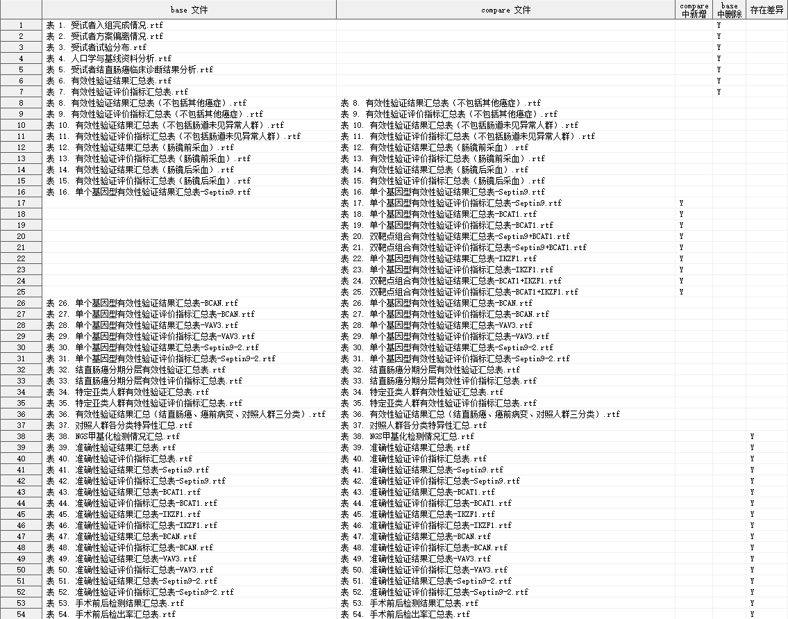

## 简介

比较两个目录下的所有 RTF 文件的内容。

## 语法

### 必选参数

- [BASEDIR](#basedir)
- [COMPAREDIR](#comparedir)

### 可选参数

- [IGNORECREATIM](#ignorecreatim)
- [IGNOREHEADER](#ignoreheader)
- [IGNOREFOOTER](#ignorefooter)
- [IGNORECELLSTYLE](#ignorecellstyle)
- [OUTDATA](#outdata)

### 调试参数

- [DEL_TEMP_DATA](#del_temp_data)

## 参数说明

### BASEDIR

**Syntax** : _path_ | _fileref_

指定比较的 BASE 目录路径或目录引用。

**Caution** : 如果路径过长，应当事先使用 `filename` 语句为目录定义引用，再将目录引用名传入参数 BASEDIR。

**Example** :

```sas
BASEDIR = "~\table\draft"
```

```sas
filename bdir "~\table\draft";
BASE = bdir
```

---

### COMPAREDIR

**Syntax** : _path_ | _fileref_

指定比较的 COMPARE 目录路径或文件引用。

**Caution** : 如果路径过长，应当事先使用 `filename` 语句为目录定义引用，再将目录引用名传入参数 COMPAREDIR。

**Example** :

```sas
COMPAREDIR = "~\table"
```

```sas
filename cdir "~\table";
BASE = cdir
```

---

### IGNORECREATIM

用法同 [IGNORECREATIM](./CompareRTF.md#ignorecreatim)

---

### IGNOREHEADER

用法同 [IGNOREHEADER](./CompareRTF.md#ignoreheader)

---

### IGNOREFOOTER

用法同 [IGNOREFOOTER](./CompareRTF.md#ignorefooter)

---

### IGNORECELLSTYLE

用法同 [IGNORECELLSTYLE](./CompareRTF.md#ignorecellstyle)

---

### OUTDATA

**Syntax** : <_libname._>_dataset_(_dataset-options_)

指定输出差异比较结果的数据集。

_libname_: 数据集所在的逻辑库名称

_dataset_: 数据集名称

_dataset-options_: 数据集选项，兼容 SAS 系统支持的所有数据集选项

输出数据集有 5 个变量，具体如下：

| 变量名           | 含义           |
| ---------------- | -------------- |
| BASE_RTF_NAME    | base 文件名    |
| COMPARE_RTF_NAME | compare 文件名 |
| ADDYN            | compare 中新增 |
| DELYN            | base 中删除    |
| DIFFYN           | 存在差异       |

**Default** : DIFF

**Example** :

```sas
OUTDATA = DIFF
INDATA = CMP.DIFF
INDATA = CMP.DIFF(keep = BASE_RTF_NAME COMPARE_RTF_NAME DIFFYN)
```

---

### DEL_TEMP_DATA

**Syntax** : YES | NO

指定是否删除宏程序运行过程产生的临时数据集，可选 YES | NO

**Default** : YES

⚠ 该参数通常用于调试，用户无需关注。

## 结果示例


