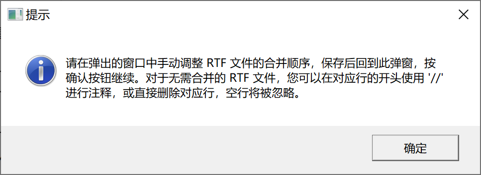

## MergeRTF

合并 RTF 文件。

## 依赖

无。

## 语法

### 必选参数

- [DIR](#dir)

### 可选参数

- [OUT](#out)
- [RTF_LIST](#rtf_list)
- [DEPTH](#depth)
- [AUTOORDER](#autoorder)
- [EXCLUDE](#exclude)
- [VD](#vd)
- [MERGE](#merge)
- [MERGED_FILE_SHOW](#merged_file_show)
- [LINK_TO_PREV](#link_to_prev)

### 调试参数

- [DEL_TEMP_DATA](#del_temp_data)

## 参数说明

#### DIR

**Syntax** : _path_ | _fileref_

指定 RTF 文件夹路径或引用。指定的文件夹路径必须是一个合法的 Windows 路径。

**Caution** :

- 指定物理路径时，可以传入带引号的路径或不带引号的路径，若传入不带引号的路径，建议使用 `%str()` 将路径包围
- 当指定的物理路径太长时，应当使用 filename 语句建立文件引用，然后传入文件引用，否则会导致 SAS 无法正确读取。

**Example** :

```
DIR = "D:\~\TFL"
```

```
DIR = %str(D:\~\TFL)
```

```
filename ref "D:\~\TFL";
DIR = ref;
```

---

#### OUT

**Syntax** : _filename_

指定合并后的 RTF 文件名称，需包含扩展名。合并后的 RTF 文件将保存在参数 [DIR](#dir) 指定的文件夹下。

**Default** : #AUTO

默认文件名为：merged-_yyyy-mm-dd hh-mm-ss_.rtf，其中 _`yyyy-mm-dd`_ 表示当前系统日期，_`hh-mm-ss`_ 表示当前系统时间。

**Example** :

```
OUT = "合并表格.rtf"
```

---

#### RTF_LIST

**Syntax** : _filename_

指定定义合并清单的外部文件名，需包含扩展名。

文件 _filename_ 应包含如下形式的文本（文件名仅作示例，与实际情况不完全相同）：

```
// X:\01 table\draft\表 7.3.3 不良事件汇总 安全集.rtf
// X:\01 table\draft\表 7.3.4 按系统器官分类和首选术语汇总 AE 安全集.rtf
// X:\01 table\draft\表 7.3.5 按系统器官分类和首选术语汇总 TEAE 安全集.rtf
// X:\01 table\draft\表 7.3.6 按系统器官分类和首选术语汇总 SAE 安全集.rtf

X:\01 table\表 7.3.3 不良事件汇总 安全集.rtf
X:\01 table\表 7.3.4 按系统器官分类和首选术语汇总 AE 安全集.rtf
X:\01 table\表 7.3.5 按系统器官分类和首选术语汇总 TEAE 安全集.rtf
X:\01 table\表 7.3.6 按系统器官分类和首选术语汇总 SAE 安全集.rtf

X:\01 table\表 7.3.7 按系统器官分类和首选术语汇总与试验用产品相关的 TEAE 安全集.rtf
X:\01 table\表 7.3.8 按系统器官分类和首选术语汇总与试验用产品相关的 SAE 安全集.rtf
X:\01 table\表 7.3.9 按系统器官分类、首选术语和严重程度汇总 TEAE 安全集.rtf
```

其中，每一行文本代表一个需要合并的 RTF 文件的路径。

例外：

- 以 `//` 开头的文本为注释，`//` 后面的 RTF 文件将不会被合并
- 空行将被忽略

宏程序将按照文件 _filename_ 中文本指定的 RTF 路径，从上到下的顺序进行 RTF 文件的合并。

**Default** : #NULL

默认情况下，宏程序将根据参数 [AUTOORDER](#autoorder) 的值决定是否进行自动排序或手动排序。若指定 `AUTOORDER = NO`，则弹出窗口要求用户进行手动排序，生成经过排序后的 RTF 文件清单副本，并再次递归调用宏程序自身，递归调用时，指定 `RTF_LIST = rtf_list_copy.txt`。

**Example** :

```
rtf_list = rtf_list_copy.txt
```

**Tips** :

- 一般情况下，可以先指定 `AUTOORDER = NO`，在弹出的窗口中对 RTF 文件进行手动排序、删除（或添加 `//` 进行注释），宏程序将在参数 `OUT` 指定的文件夹下生成 `rtf_list_copy.txt` 文件，如 RTF 文件发生变更需再次合并，可指定 `RTF_LIST = rtf_list_copy.txt`。

---

#### DEPTH

**Syntax** : _numeric_

指定遍历 RTF 文件的子文件夹深度。取值范围：

若需要合并的 RTF 文件存储在参数 `DIR` 指定的文件夹的子文件夹中。例如：某项目在 `~\TFL` 目录下包含三个子文件夹，名称分别为： `table`, `figure`, `listing` 中，此时指定 `DEPTH = 2`，宏程序将读取根目录 `~\TFL` 及其子文件夹 `~\TFL\table`, `~\TFL\figure`, `~\TFL\listing` 中的所有 RTF 文件，但不会读取 `~\TFL\table`, `~\TFL\figure`, `~\TFL\listing` 下的子文件夹中的 RTF 文件。

通过下面的文件夹结构可以更好地理解这一参数：

- `DEPTH = 1`

  ```
  ~:.
  └─TFL
  ```

  合并根目录 `~\TFL` 中的所有 RTF 文件。

- `DEPTH = 2` :

  ```
  ~:.
  └─TFL
    ├─table
    ├─figure
    ├─listing
    └─other
  ```

  合并根目录 `~\TFL` 及其子文件夹 `~\TFL\table`, `~\TFL\figure`, `~\TFL\listing` 中的所有 RTF 文件。

- `DEPTH = 3` :
  ```
  ~:.
  └─TFL
    ├─table
    │ └─draft
    ├─figure
    ├─listing
    │ └─draft
    └─other
  ```
  合并根目录 `~\TFL` 及其子文件夹 `~\TFL\table`, `~\TFL\figure`, `~\TFL\listing`，以及 `~\TFL\table\draft`, `~\TFL\listing\draft` 中的所有 RTF 文件。

**Caution** :

- 当 [RTF_LIST](#rtf_list) 指定了非 `#NULL` 值时，此参数将被忽略。

**Default** : MAX

默认情况下，宏程序将合并参数 [DIR](#dir) 指定的文件夹下任何深度的子文件夹内的 RTF 文件。

**Tips** :

- 在 Windows 中，可通过 `tree` 命令显示当前路径的文件夹结构。

---

#### AUTOORDER

**Syntax** : YES | NO

指定是否自动排序

**Default** : YES

- `AUTOORDER = YES` 时，宏程序根据 RTF 文件名自动排序，排序的具体细节见 [#2](#2-如何对-rtf-文件进行排序)
- `AUTOORDER = NO` 时，宏程序将弹出提示框，提示用户进行手动排序，同时打开一个包含当前目录下所有 RTF 文档名称的 .txt 文件，用户可调整此 .txt 文件中 RTF 文档名称显示的顺序，通过这种方式完成手动排序，保存此 .txt 文件后，点击确定，宏程序将会继续运行。



**Caution** :

- 当 [RTF_LIST](#rtf_list) 指定了非 `#NULL` 值时，此参数将被忽略。

---

#### EXCLUDE

**Syntax** : _placeholder_

指定排除名单，暂无作用。

**Default** ：#NULL

**Caution** :

- 当 [RTF_LIST](#rtf_list) 指定了非 `#NULL` 值时，此参数将被忽略。

---

#### VD

**Syntax** : _drive_

指定临时创建的虚拟磁盘的盘符，该盘符必须是字母 A ~ Z 中未被操作系统使用的一个字符

默认值：X

---

#### MERGE

**Syntax** : YES | NO

指定是否执行合并。

此参数通常用于测试运行，如果你需要合并的 RTF 文件过多，或者你不确定指定的参数（尤其是参数 `DEPTH`）是否正确，可以先指定参数 `MERGE = NO`，此时宏程序将不会执行合并操作，但会输出数据集 `WORK.RTF_LIST`，你可以查看此数据集，了解具体将会被合并的 RTF 文件。在该数据集中，仅当变量 `rtf_filename_valid_flag` 和 `rtf_depth_valid_flag` 同时为 `Y` 时，对应路径上的 RTF 文件才会被合并。

**Caution** :

- 当 [RTF_LIST](#rtf_list) 指定了非 NULL 值时，数据集 `WORK.RTF_LIST` 中变量 `rtf_filename_valid_flag` 和 `rtf_depth_valid_flag` 的值均为 `Y`。

**Default** ：YES

---

#### MERGED_FILE_SHOW

**Syntax** : _path_type_

指定 RTF 文件在日志中显示的路径类型，_`path_type`_ 可取值如下：

- `SHORT`：仅显示文件名
- `FULL`：显示完整路径
- `VIRTUAL`：显示虚拟磁盘路径

**Default** ：SHORT

---

#### DEL_TEMP_DATA

**Syntax** : YES | NO

指定是否删除宏程序运行产生的中间数据集

**Default** ：YES

---

#### LINK_TO_PREV

**Syntax** : YES | NO

指定是否将第二张及之后的 RTF 文件的页眉页脚链接到前一节

**Default** : NO

默认情况下，宏程序不会将第二张及之后的 RTF 文件的页眉页脚链接到前一节。

如果待合并的 RTF 文件的页眉或页脚包含相同的图片（例如：企业 logo 图片），则建议指定 `LINK_TO_PREV = YES`，宏程序将仅保留第一张 RTF 文件的页眉页脚，后续 RTF 文件的页眉页脚将自动链接到前一节，以压缩合并后的 RTF 文件的体积。

以下两种典型情况，指定 `LINK_TO_PREV = YES` 带来的时间成本与收益如下：

| 典型情况         | 参数值             | 花费时间    | 文件体积    |
| ---------------- | ------------------ | ----------- | ----------- |
| 页眉页脚包含图片 | LINK_TO_PREV = NO  | 7.20s       | 16510KiB    |
|                  | LINK_TO_PREV = YES | 8.87s       | 4644KiB     |
|                  |                    | **+23.19%** | **-71.87%** |
| 页眉页脚不含图片 | LINK_TO_PREV = NO  | 10.39s      | 14084KiB    |
|                  | LINK_TO_PREV = YES | 16.27s      | 14006KiB    |
|                  |                    | **+56.59%** | **-0.55%**  |

\* 上述表格数据是基于 SAS 9.4M7 运行在 Windows 10 上的单次测试结果，仅供参考。

可以发现，并非在所有情况下指定 `LINK_TO_PREV = YES` 都能带来明显收益。

- 当 RTF 文件的页眉、页脚包含图片时，指定 `LINK_TO_PREV = YES` 会增加少量运行时间，文件体积明显减小；
- 当 RTF 文件的页眉、页脚不含图片时，指定 `LINK_TO_PREV = YES` 会增加大量运行时间，文件体积几乎不变；

**Caution** :

- 如果 RTF 文件的页眉仅包含文本内容，则谨慎指定 `LINK_TO_PREV = YES`。

---

## 细节

### 1. 如何读取指定递归深度的子文件夹中 RTF 文件

使用 DOS 命令 `DIR` 的参数 `/s`，可以遍历指定目录下的文件，包括任意深度子文件夹中的文件，将获取到的文件路径列表写入外部文件 `_tmp_rtf_list.txt` 中。在 SAS 中，使用 `infile` 语句读取 `_tmp_rtf_list.txt`。由于在 Windows 系统下，文件名不能含有 `\`，因此，文件路径中的 `\` 的数量可以被视为文件所处子文件夹的深度，假设指定 `depth = n`，宏程序将筛选出路径包含的 `\` （路径中参数 `DIR` 部分的 `\` 不计入）的数量不超过 n 的文件，仅对筛选出的文件进行后续的处理。

### 2. 如何对 RTF 文件进行排序

首先使用以下正则表达式筛选需要合并的 RTF 文件：

```
^.*((?:列)?表|清单|图)\s*(\d+(?:\.\d+)*)\.?\s*(.*)\.rtf\s*$/o
```

上述正则表达式中，包含 3 个缓冲区：

缓冲区 1：表、列表、清单、图

缓冲区 2：序号

缓冲区 3：标题

宏程序将使用缓冲区 2 中的序号对 RTF 文件进行排序，序号通常由若干数字和数字中间的 `.` 组成，这通常是为了表示 RTF 文件之间的相对位置和层级关系，利用这些数字，可以将 RTF 文件进行正确的排序。

若缓冲区 2 中的序号完全一致，则进一步根据缓冲区 1 的 RTF 文件类型进行排序，顺序如下：

- 表
- 图
- 列表
- 清单

若缓冲区 1 中的 RTF 文件类型完全一致，则进一步根据缓冲区 3 的 RTF 文件标题进行排序；

若缓冲区 3 中的 RTF 文件标题完全一致，则进一步根据 RTF 文件所在文件夹的深度进行排序。

以下是一个正确排序的例子：

```
X:\表7.1.1 ~.rtf
X:\表7.1.2 ~.rtf
X:\表7.1.2.1 ~.rtf
X:\表7.1.9 ~.rtf
X:\图7.1.9 ~.rtf
X:\draft\图7.1.9 ~.rtf
X:\表7.1.10 ~.rtf
```

### 3. 如何合并 RTF 文件

合并 RTF 文件大体遵循以下步骤：

1. 第一个 RTF 文件，**保留**所有元信息，删除结尾的右半括号`}`
2. 中间的 RTF 文件，去除开头的元信息，同时在开头添加分节符，删除结尾的右半括号`}`
3. 最后一个 RTF 文件，去除开头的元信息，同时在开头添加分节符，**保留**结尾的右半括号`}`

#### 3.1 分节符处理

宏程序使用以下正则表达式识别需要添加分节符的位置：

```
/^\\sectd\\linex\d\\endnhere\\pgwsxn\d+\\pghsxn\d+\\lndscpsxn\\headery\d+\\footery\d+\\marglsxn\d+\\margrsxn\d+\\margtsxn\d+\\margbsxn\d+$/o
```

当该正则表达式成功匹配时，在当前行的开头插入控制字 `\sect` 即可。

#### 3.2 元信息处理

[3.1](#31-分节符处理) 中的正则表达式第一次匹配之前的所有信息均为元信息，由于同一个项目下的 RTF 文件元信息（字体表、颜色表等）通常是一致的，这些信息在合并的第一个 RTF 中已经保留，因此，在合并的第二个 RTF 文件及其后续的 RTF 文件中，这部分信息可以删除。

#### 3.3 大纲级别标记处理

某些 RTF 文件由于跨越多页，可能已经包含分节符，直接合并会导致在左侧导航窗格中，同一个 RTF 文件显示了多个导航项目的情况。对于这种情况，宏程序首先使用以下正则表达式识别首个具有大纲级别标记的文本：

```
/\\outlinelevel\d{(.*)}/o
```

之后继续检查是否存在额外的相同的大纲级别标记的文本，如果发现，使用以下正则表达式将大纲级别标记替换为空字符：

```
s/\\outlinelevel\d//o
```

通过上述操作，单个表（图）在合并后的 RTF 文件中，仅具有一个大纲级别标记。

### 4. 如何控制日志的隐藏和显示

由于宏程序使用场景涉及到大量 RTF 文件，读写数据集会生成大量 log，可以使用以下代码临时“隐藏” log：

```
proc printto log=_null_;
run;
```

在需要显示 log 的地方，使用以下代码重新打开：

```
proc printto log=log;
run;
```

尽管如此，这里的“隐藏”并非真正意义上的隐藏，你仍然可以在宏程序运行过程中，前往当前工作目录下的 `_null_.log` 中查看日志，不过，宏程序在结束前会使用 `del` 命令删除这个文件。

### 5.变量比较涉及到的磁盘读写的优化

在 [大纲级别标记处理](#33-大纲级别标记处理) 部分，宏程序需要识别当前 RTF 代码行是否存在前面已经定义过的大纲级别标记，若存在相同的大纲级别标记，则删除 `\outlilelevel` 控制字，以确保合并后的 RTF 文件不存在重复的大纲级别标记。

由于在读取 RTF 文件前，无法预知知道 RTF 单行代码的最长字符数量，为保证完整读取所有字符串，宏程序使用了 SAS 所能支持的最大长度 32767 存储每一行 RTF 代码，在识别重复大纲级别标记部分，需要比较前后两个大纲级别标记的字符串，32767 长度的变量会消耗大量时间。

事实上，这些 32767 长度的字符串中，只有一小段的字符串是有意义的，可以使用 SAS 自带的 `hashing` 函数先计算字符串的 MD5 值，通过比较两个字符串的 MD5 值，从而间接比较两个字符串的值。由于 MD5 值的长度为 32，因此原本需要比较 32767 个字符，通过这么一番操作，只需要比较 32 个字符即可。MD5 的计算很快，增加的运算时间完全可以通过需比较字符串的长度降低来抵消，从而大幅加快运算时间。


## 示例程序

```sas
%MergeRTF("~\TFL");

%MergeRTF("~\TFL", out = merged.rtf)

%MergeRTF("~\TFL", out = merged.rtf, depth = 2);

%MergeRTF("~\TFL", out = merged.rtf, depth = 2, vd = Y);

%MergeRTF("~\TFL", out = merged.rtf, depth = 2, vd = Y, merge = no);

%MergeRTF("~\TFL", out = merged.rtf, rtf_list = rtf_list_copy.txt);
```
