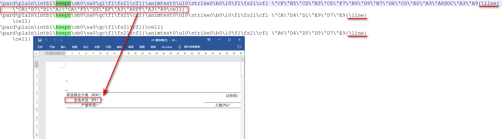
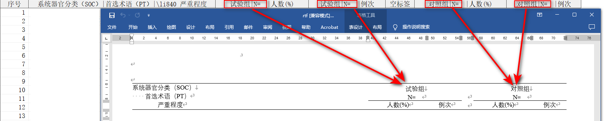

## ReadRTF

### 程序信息

- 名称：ReadRTF.sas
- 类型：Macro
- 依赖：[Transcode](./Transcode.md) -> [Cell_Transcode](./Cell_Transcode.md) -> [ReadRTF](./ReadRTF.md)
- 功能：SAS ODS RTF 使用 RTF 1.6 specification 输出 RTF 文件，本程序实现了将输出的 RTF 文件逆向转为 SAS 数据集的功能。

### 程序执行流程
1. 根据参数 FILE 的值获取文件的物理路径
2. 读取 RTF 文件，单行 RTF 字符串存储在变量 `line` 中；
3. 调整表头，部分 RTF 的表头含有回车，这可能会导致 RTF 代码在回车处折行，这一步解决了折行导致的变量标签无法正常解析的问题，该问题在 Table 中经常出现；
4. 识别表格中的数据。表格出现在标题后面，对于表格跨页的第一行数据，对应的 RTF 代码会稍有不同，使用以下正则表达式进行识别：
    - 标题：`/\\outlinelevel\d/o`
    - 表头定义起始行：`/\\trowd\\trkeep\\trhdr\\trq[lcr]/o`
    - 表头属性定义行：`/\\clbrdr[tlbr]\\brdrs\\brdrw\d*\\brdrcf\d*(?:\\clbrdr[tlbr]\\brdrs\\brdrw\d*\\brdrcf\d*)*\\cltxlrt[bl]\\clvertal[tcb](?:\\clcbpat\d*)?\\cellx(\d+)/o`
    - 数据行：`/^\\pard\\plain\\intbl(?:\\keepn)?\\sb\d*\\sa\d*\\q[lcr]\\f\d*\\fs\d*\\cf\d*\{((?:\\'[0-9A-F]{2}|\\u\d{1,5};|[[:ascii:]])*)\\cell\}$/o`
    - 分节符标识行：`/\\sect\\sectd\\linex\d*\\endnhere\\pgwsxn\d*\\pghsxn\d*\\lndscpsxn\\headery\d*\\footery\d*\\marglsxn\d*\\margrsxn\d*\\margtsxn\d*\\margbsxn\d*/o`
5. 开始转换数据。调用 [Cell_Transcode](./Cell_Transcode.md) 函数，将单元格内的字符串转换为可读的字符串；
6. 使用 `PROC TRANSPOSE` 对上一步产生的数据集进行转置；
7. 处理变量标签，这一步主要是解决表头标签跨越多行可能导致的标签错位的问题
8. 修改数据集属性，包括缩减变量长度，添加标签
9. 输出至参数 `OUTDATA` 指定的数据集中
10. 删除中间步骤产生的数据集

### 参数
#### FILE
类型 : 必选参数

取值 : 指定 RTF 文件路径或引用。指定的文件路径或者引用的文件路径必须是一个合法的 Windows 路径。
- 指定物理路径时，可以传入带引号的路径或不带引号的路径，若传入不带引号的路径，建议使用 `%str()` 将路径包围
- 当指定的物理路径太长时，应当使用 filename 语句建立文件引用，然后传入文件引用，否则会导致 SAS 无法正确读取。

举例 : 
```
FILE = "D:\~\表7.1.1 受试者分布 筛选人群.rtf"
```

```
FILE = %str(D:\~\表7.1.1 受试者分布 筛选人群.rtf)
```

```
filename ref "D:\~\表7.1.1 受试者分布 筛选人群.rtf";
FILE = ref;
```

#### OUTDATA
类型 : 必选参数

取值 : 指定输出数据集名称。

举例 :

```
OUTDATA = t_7_1_1
```

#### COMPRESS
类型 : 可选参数

取值 : 指定临时数据集是否压缩，可选 YES | NO

默认值 : YES

⚠ 绝大部分情况下，参数 COMPRESS 都应当保持默认值，这虽然会增加一点点 CPU 时间，但可以节省大量磁盘占用空间，特别是在读取的 RTF 文件数据量特别大的情况下。经过测试，使用 COMPRESS = YES 平均可节省 95% 以上的磁盘占用空间。

⚠ 宏程序为保证读取的变量值不会被截断，读取时采用了 SAS 支持的最大变量长度 32767，在未指定 COMPRESS = YES 的情况下，几乎每张表格读取后所占用的磁盘空间都将超过 1G，这非常容易导致磁盘可用空间的急剧下滑，甚至会导致磁盘空间不足而报错，同时频繁大量读写也会迅速减少磁盘寿命。使用 COMPRESS = YES 通过略微牺牲 CPU 时间，获得低负载的磁盘读写，延长使用寿命。

#### DEL_RTF_CTRL
类型 : 可选参数

取值 : 指定是否删除单元格中的控制字

默认值 : YES

#### DEL_TEMP_DATA
类型：可选参数

取值：指定是否删除宏程序运行过程产生的临时数据集，可选 YES|NO

默认值：YES

⚠ 该参数通常用于调试，用户无需关注。

### 细节

#### 1. 如何根据参数 FILE 的值获取文件的物理路径

首先，SAS 文件引用名称不超过 8 个字符，且必须是一个合法的 SAS 名称；可根据下列正则表达式初步判断是文件路径还是文件引用：

```
/^(?:([A-Za-z_][A-Za-z_0-9]{0,7})|[%str(%"%')]?((?:[A-Za-z]:\\|\\\\[^\\\/:?%str(%")<>|]+)[^\\\/:?%str(%")<>|]+(?:\\[^\\\/:?%str(%")<>|]+)*)[%str(%"%')]?)$/
```

上述正则表达式包含两个 buffer：
- buffer1 : 匹配文件引用
- buffer2 : 匹配 Windows 路径名称，不支持匹配含有环境变量的路径（例如：`%TEMP%\~.rtf`）

若 buffer 1 的内容不为空，则参数 FILE 指定的可能是一个文件引用

若 buffer 2 的内容不为空，则参数 FILE 指定的可能是一个 Windows 文件路径

在 buffer1 的内容不为空的前提下，使用 SAS 函数 `fileref()` 判断文件引用是否存在：
- fileref() 函数返回正数，则 FILE 指定的文件引用未定义
- fileref() 函数返回负数，则 FILE 指定的文件引用已定义，但文件引用的物理路径不存在
- fileref() 函数返回零，则 FILE 指定的文件引用已定义，且文件引用的物理路径存在

在上述 fileref() 函数返回零的情况下，使用 SAS 函数 `pathname()` 获取文件引用的物理路径。


#### 2. 如何读取外部 RTF 文件
SAS ODS RTF 使用 RTF 1.6 specification 输出 RTF 文件，本质上是一些纯文本标记（markup）字符。使用 `infile` 读取 RTF 文件，并存储在临时数据集 `_tmp_rtf_data` 中。

RTF 文件单行字符串没有限制长度，为确保读取的 RTF 标记字符不会被截断，数据集 `_tmp_rtf_data` 中的变量均使用 SAS 允许的最大长度 32767，同时默认使用 `compress = yes` 数据集选项，防止因磁盘空间不足导致程序无法运行。

#### 3. 如何解决表头内嵌换行符导致的 RTF 标记字符跨越多行的问题
对于使用了 `split = char` 在表头内部进行换行的 RTF 文件，根据观察，SAS 输出 RTF 文件时，当遇到指定的 split 字符时，SAS 将在 RTF 文件中写入控制字 `{\line}`，并在下一行继续写入 split 字符之后的文本，当某个单元格内的文本结束时，SAS 在 RTF 文件中写入控制字 `\cell`，表示这个单元格的字符串已经全部写入完成。

根据上述规律，可以采用下列逻辑识别 RTF 文件中的表头内嵌换行符的问题：
1. 使用以下正则表达式识别出现内嵌换行符的表头

```
/^(\\pard\\plain\\intbl\\keepn\\sb\d*\\sa\d*\\q[lcr]\\f\d*\\fs\d*\\cf\d*\{.*){\\line}$/o
```

2. 在上一步成功匹配正则表达式的基础上，连续使用以下正则表达式识别连续的内嵌换行符

```
/^(.*){\\line}$/o
```

3. 直到使用以下正则表达式识别到单元格的结束位置

```
^(.*\\cell})$/o
```

上述步骤中，步骤2可能会重复多次，每次识别到内嵌的换行符时，都将文本提取出来，并与上一步骤提取的文本拼接，同时删除当前行，直到步骤3，此时所有内嵌的换行符均已删除，拼接后的文本即为单元格内的完整文本。



#### 4. 如何识别 RTF 中的数据

使用 SAS 输出 RTF 时，通常会使用控制字 `\outlinelevel` 定义表格标题的大纲级别，便于后续合并 RTF 时自动输出目录，所有实际存储的数据都在控制字 `\outlinelevel` 之后定义。具体的识别过程如下：

1. 使用以下正则表达式匹配定义了大纲级别的表格标题

```
/\\outlinelevel\d/o
```

2. 使用以下正则表达式匹配表格表头的开始定义位置

```
/\\trowd\\trkeep\\trhdr\\trq[lcr]/o
```
上述正则表达式中，关键的控制字是 `\trhdr`，它表示表格的表头行，出现在当前表格的所有页面之前

3. 使用以下正则表达式匹配表格表头单元格的右边框位置

```
/\\clbrdr[tlbr]\\brdrs\\brdrw\d*\\brdrcf\d*(?:\\clbrdr[tlbr]\\brdrs\\brdrw\d*\\brdrcf\d*)*\\cltxlrt[bl]\\clvertal[tcb](?:\\clcbpat\d*)?\\cellx(\d+)/o
```
上述正则表达式中，关键的控制字是 `\cellx` 其中 `\d+` 代表单元格右边框的位置。某些表格的表头含有多行，且包含单元格的合并，根据不同行的单元格的右边框位置，可以计算上一行某个单元格是由哪几个单元格合并而来，这些信息在后续给输出数据集定义标签时会有用，利用这些信息可以精确控制多行的标签是如何组合的，防止标签被定义在错误的变量上。

4. 使用以下正则表达式匹配数据行

```
^\\pard\\plain\\intbl(?:\\keepn)?\\sb\d*\\sa\d*\\q[lcr]\\f\d*\\fs\d*\\cf\d*\{((?:\\'[0-9A-F]{2}|\\u\d{1,5};|[[:ascii:]])*)\\cell\}$/o
```

上述正则表达式中，包含了3种类型的数据编码形式：
- `\\'[0-9A-F]{2}` : GBK
- `\\u\d{1,5};` : UTF-8
- `[[:ascii:]]` : ASCII

其中 GBK 和 UTF-8 字符是以转义字符表示的，需要进一步转换成以 SAS 当前环境下的编码存储的字符串。

5. 使用以下正则表达式匹配分节符

```
/\\sect\\sectd\\linex\d*\\endnhere\\pgwsxn\d*\\pghsxn\d*\\lndscpsxn\\headery\d*\\footery\d*\\marglsxn\d*\\margrsxn\d*\\margtsxn\d*\\margbsxn\d*/o
```

某些 RTF 为了在每一页中重复表格标题，可能会使用分节符，这样会导致读取 RTF 文件时，从第2页开始，页脚的文本也被当做数据行被输出到数据集中，为了解决这一问题，使用这个正则表达式识别到分节符后，应当再次寻找定义了大纲级别的表格标题，在分节符之后，定义了大纲级别的表格标题之前的任何 RTF 标记文本都将被忽略。

#### 5. 如何将转义字符转换为正常可读的字符串
调用 PROC FCMP 函数 [Cell_Transcode()](../DOCS/Cell_Transcode.md)


#### 6. 如何定义变量名称和变量标签
RTF 文件本身不含原始的 SAS 变量名，因此程序只能根据变量在 RTF 文件中出现的先后顺序，依次命名为 `COL1`、`COL2`、`COL3`、...。除此之外，程序额外生成一列变量 `OBS_SEQ` 代表观测序号。

变量标签根据 [#4](#4-如何识别-rtf-中的数据) 中获得到的表格表头单元格的右边框位置，对跨越多行的标签进行组合，合并后的单元格标签将会重复，重复次数取决于其自身跨越的宽度在其他行相同位置和宽度下显示的单元格数量。



#### 7. 如何识别单元格中的控制字
指定参数 `DEL_RTF_CTRL = YES` 将删除单元格内的控制字。SAS 输出 RTF 时可能会为某些文字添加格式，这些格式通常以控制字的方式存储在 RTF 文件中，本宏程序可以将这些控制字删除，已支持的控制字及使用的正则表达式如下：

- 空的分组：`{\s*}|(?<!\\)[{}]`
- 缩进：`\\li\d+`
- 上标：`{\\super.*?}|\\super[^\\]+`
- 取消上下标：`\\nosupersub`

宏程序使用下面的正则表达式将上述控制字替换为空字符，其中 `<reg_ctrl>` 表示上述合并后的正则表达式：

```
s/(?:<reg_ctrl>)\s*//o
```

### 示例程序

```sas
%ReadRTF(file = "D:\~\表7.1.1 受试者分布 筛选人群.rtf", outdata = t_7_1_1);

%ReadRTF(file = "D:\~\表7.1.1 受试者分布 筛选人群.rtf", outdata = t_7_1_1, compress = yes);

%ReadRTF(file = "D:\~\表7.1.1 受试者分布 筛选人群.rtf", outdata = t_7_1_1, compress = yes, del_rtf_ctrl = yes);

%ReadRTF(file = "D:\~\表7.1.1 受试者分布 筛选人群.rtf", outdata = t_7_1_1, compress = yes, del_rtf_ctrl = yes, del_temp_data = yes);

%ReadRTF(file = %str(D:\~\表7.1.1 受试者分布 筛选人群.rtf), outdata = t_7_1_1);

filename rtfref "D:\~\表7.1.1 受试者分布 筛选人群.rtf";
%ReadRTF(file = rtfref, outdata = t_7_1_1);
```