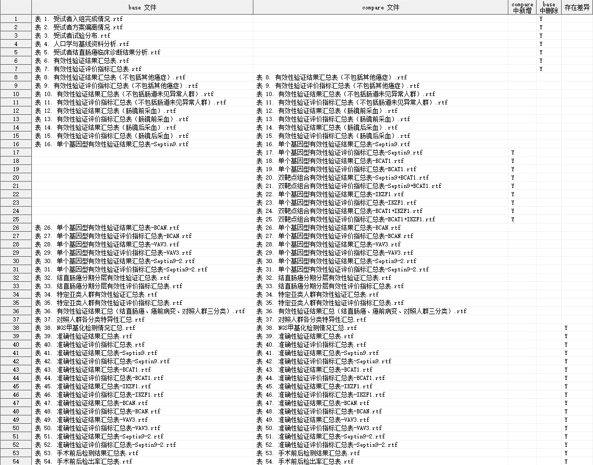

# %compare_rtf_dir

比较两个目录下的所有 RTF 文件的内容。

**Compatibility** : RTF 1.6 specification

## 依赖

[%compare_rtf](compare_rtf.md) -> [%compare_rtf_dir](compare_rtf_dir.md)

## 语法

### 必选参数

- [base_dir](#base_dir)
- [compare_dir](#compare_dir)

### 可选参数

- [ignore_create_time](#ignore_create_time)
- [ignore_header](#ignore_header)
- [ignore_footer](#ignore_footer)
- [ignore_cell_style](#ignore_cell_style)
- [ignore_font_table](#ignore_font_table)
- [ignore_color_table](#ignore_color_table)
- [outdata](#outdata)

### 调试参数

- [debug](#debug)

## 参数说明

### base_dir

**Syntax** : _path_ | _fileref_

指定基准目录的物理路径或 _filename_ 引用。

> [!IMPORTANT]
>
> - 如果路径过长，应当事先使用 `filename` 语句为目录定义引用，再将目录引用名传入参数 `base_dir`。

**Example** :

```sas
base_dir = "~\table\draft"
```

```sas
filename bdir "~\table\draft";
base_dir = bdir
```

---

### compare_dir

**Syntax** : _path_ | _fileref_

指定比较目录的物理路径或 _filename_ 引用。

> [!IMPORTANT]
>
> - 如果路径过长，应当事先使用 `filename` 语句为目录定义引用，再将目录引用名传入参数 `compare_dir`。

**Example** :

```sas
compare_dir = "~\table"
```

```sas
filename cdir "~\table";
compare_dir = cdir
```

---

### ignore_create_time

用法同 [ignore_create_time](./compare_rtf.md#ignore_create_time)

---

### ignore_header

用法同 [ignore_header](./compare_rtf.md#ignore_header)

---

### ignore_footer

用法同 [ignore_footer](./compare_rtf.md#ignore_footer)

---

### ignore_cell_style

用法同 [ignore_cell_style](./compare_rtf.md#ignore_cell_style)

---

### ignore_font_table

用法同 [ignore_font_table](./compare_rtf.md#ignore_font_table)

---

### ignore_color_table

用法同 [ignore_color_table](./compare_rtf.md#ignore_color_table)

---

### outdata

**Syntax** : <_libname._>_dataset_(_dataset-options_)

指定输出差异比较结果的数据集。

_libname_: 数据集所在的逻辑库名称

_dataset_: 数据集名称

_dataset-options_: 数据集选项，兼容 SAS 系统支持的所有数据集选项

输出数据集有 5 个变量，具体如下：

| 变量名           | 含义           |
| ---------------- | -------------- |
| BASE_RTF_NAME    | base 文件名    |
| COMPARE_RTF_NAME | compare 文件名 |
| ADDYN            | compare 中新增 |
| DELYN            | base 中删除    |
| DIFFYN           | 存在差异       |

**Default** : `diff`

**Example** :

```sas
outdata = diff
outdata = cmp.diff
outdata = cmp.diff(keep = BASE_RTF_NAME COMPARE_RTF_NAME DIFFYN)
```

---

### debug

**Syntax** : `true` | `false`

指定是否删除宏程序运行过程产生的临时数据集。

**Default** : `false`

> [!NOTE]
>
> - 该参数通常用于调试，用户无需关注。

## 结果示例


